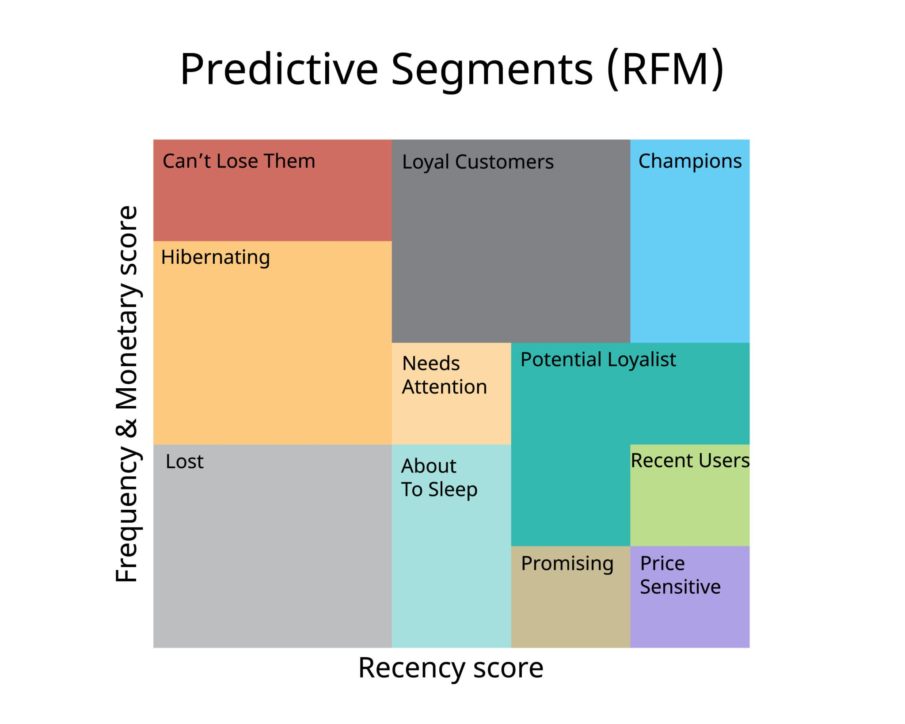

# Online Retail Analysis: From Raw Telemetry to Business Insight

## 📌 Project Overview 

This project transforms a messy, real-world retail dataset into a structured analytical environment and a strategic decision-making tool.
  
 
Leveraging *"SQL and BigQuery"* , I performed a full **ETL (Extract, Transform, Load)** process to clean over 500k rows of transactional data, followed by an **RFM (Recency, Frequency, Monetary)** analysis to segment customers by behavior.
 
 
The project culminates in visualizations created in *"Looker Studio"* supporting the insights and my recommendations to improve customer retention and international market growth.

 
 

 

## 🛠 Tech Stack

- **Database:** Google BigQuery (SQL)
- **Visualization:** Google Looker Studio
- **Data Source:** Online Retail II (via Kaggle)
- **Concepts:** Schema Mapping, ETL, Data Cleaning, CTEs (Common Table Expressions), Data Validation, Window Functions, Customer Segmentation

## 🏗 Phase 1: ETL & Data Integrity

### Data Ingestion Challenge

Initial upload attempt using "Auto-detect schema" failed due to inconsistencies in the raw CSV.

- **Solution:** I implemented a **Manual Schema Definition** (loading all fields as `STRING`). This provided a stable "landing zone," allowing for programmatic cleaning via SQL.

🔗[`View Schema Definition`](json/create_manual_schema.json)

### The Cleaning Pipeline

I developed a modular SQL view to standardize the data.

Key transformations included:

- **Data Type Casting:** Leveraged `SAFE_CAST` to handle non-numeric noise.
- **Timestamp Parsing:** Converted string dates into proper `TIMESTAMP` objects to enable time-series analysis.
- **Business Logic Filtering:** Excluded records with missing `customer_id` and non-positive `quantity` or `unit_price` to focus the analysis on successful gross sales.

🔗[`View Transformation Query`](sql/01_create_view.sql)

### Data Audit Results

By filtering out "clutter" (canceled orders and anonymous transactions), I ensured the integrity of the downstream analysis.

| Metric | Value |
| :--- | :--- |
| **Raw Records** | 541.909 |
| **Cleaned Records** | 397.884 |
| **Data Noise Removed** | ~26% |

## 📊 Phase 2: Customer Intelligence (RFM Analysis)

### Summarizing Customer Behaviour

To move beyond basic reporting, I implemented an RFM Model to categorize customers based on their behavior. Creating a SQL table, I found answers to the following questions that build our RFM summary:

- **Recency(R):** How many days ago was a customer's last purchase?
- **Frequency(F):** How many unique orders did a customer place?
- **Monetary(M):** What is the total revenue a customer generated?
  
🔗[`View RFM Summarization Query`](sql/02_rfm_summary.sql)

### The RFM Scoring

We have the raw numbers (Recency, Frequency, Monetary), but from a business perspective, it is better to see where the "Risk" is. 

 
 

 

Using the SQL `NTILE` window function, I assigned a score of 1–5 for each metric.

🔗[`View RFM Scoring Query`](sql/03_rfm_scoring.sql) 

### Customer Segmentation

I then applied a `CASE` statement to categorize customers into strategic segments.

| Customer Segment | Count | Strategic Action |
| :--- | :---: | :--- |
| **Champions** |973| Reward and use for referral programs |
| **Loyal Customers** |983| Upsell premium products |
| **Regular Customers** |1034| Marketing engagement standard |
| **Big Spenders at Risk** |341| Immediate re-engagement discount needed |
| **Lost/Hibernating** |1015| Low-cost automated win-back campaign |
 
🔗[`View Customer Segmentation Query`](sql/04_final_segment.sql)

## 🌟 Phase 3: Executive Summary & Recommendations

### Defensive Retention Strategy (High ROI)

- **Insight:** We have 341 **"Big Spenders at Risk."** These represent high-value assets that have not purchased recently.
- **Recommendation:** Launch an exclusive "We Miss You" campaign for this segment with a 15% discount. Recovering these customers is more cost-effective than acquiring new ones.

### Community & Referral (Growth)

- **Insight:** 25% of our base **(973 Champions)** are highly engaged "Power Users."
- **Recommendation:** Implement a referral program for this segment. Leveraging these brand advocates to acquire new customers will significantly lower our costs.

 
 

 

### High-Value Loyalty Audit

- **Insight:** The scatter plot confirms that our highest-value "Whale" customers are staying active. 100% of our top revenue-generators have purchased within the last 180 days, leaving the "Danger Zone" (High Revenue/High Recency) largely empty.
- **Recommendation:** Continue the current loyalty drivers for the top-tier segment while shifting marketing spend toward the Regular and At Risk segments to move them up the value chain.

 
 

  

 

### International Expansion Opportunities

- **The Insight:** 90% of revenue is concentrated in the UK, representing a Geographic Concentration Risk. However, France and Germany show the highest revenue outside the domestic market.
- **Recommendation** Test performance marketing and localized shipping promotions in Germany and France to diversify the revenue base and reduce reliance on a single market.

 
 

  

 

## 🎖 Personal Reflection

Transitioning from Electronic Warfare to Data Analytics, I've found that the core mission remains the same: extracting signals from noise to drive decision-making. Whether identifying radar signatures or customer segments, the goal is precision. This project demonstrates my ability to build the technical pipeline (SQL), ensure the accuracy of the feed (ETL), and brief the mission results (Looker Studio) to ensure strategic victory.
